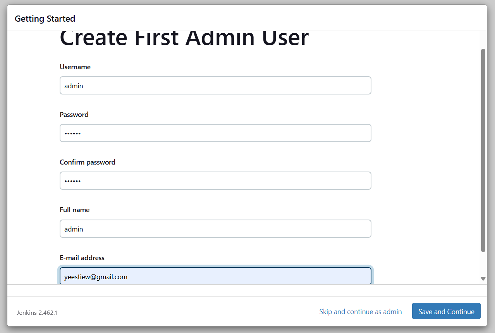
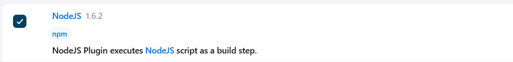
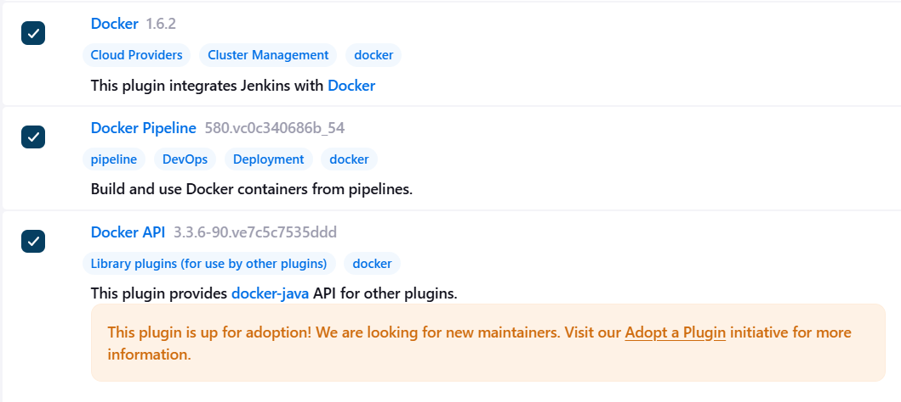
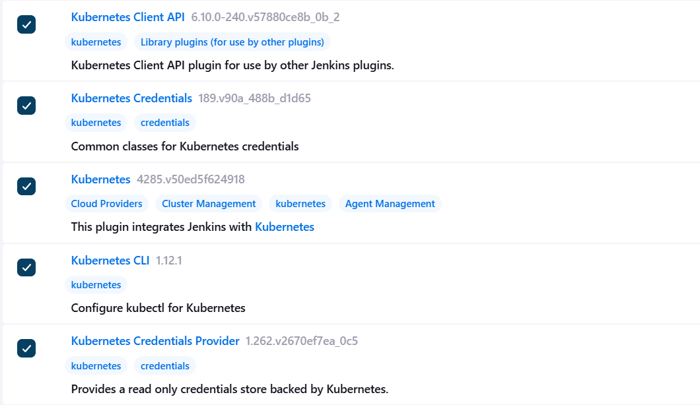
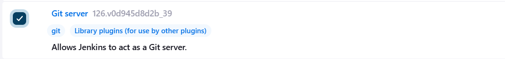
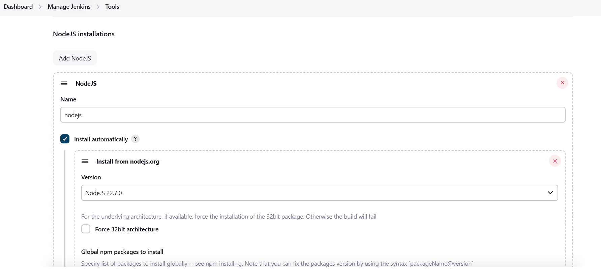
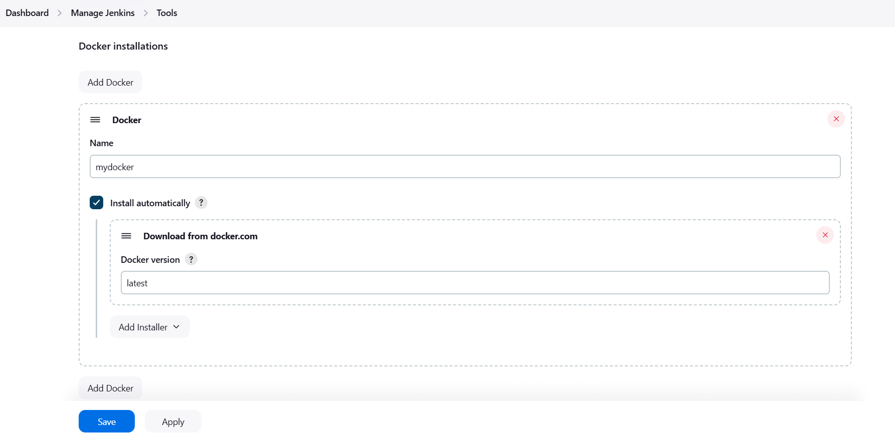

## 拉取 Jenkins 镜像

```bash
docker run -d --name jenkins \
  -v /var/run/docker.sock:/var/run/docker.sock \
  -v jenkins_home_local:/var/jenkins_home \
  -p 8080:8080 \
  -p 50000:50000 \
  jenkins/jenkins:lts
```

## 打开 Jenkins 网页

`http://localhost:8080`

进入 Jenkins 容器，复制 `cat` `/var/jenkins_home/secrets/initialAdminPassword` 到网页中



## 容器挂载宿主机

```bash
docker exec -u 0 -it jenkins bash
chmod 777 /var/run/docker.sock
```

> /var/run/docker.sock 是 Docker 守护进程的 Unix 套接字文件，通常在宿主机上，而不是在 Docker 容器内部。如果你想让你的 Jenkins 容器可以与 Docker 守护进程通信，你需要在运行 Docker 容器时，将这个套接字文件挂载到容器中，并给予权限。（如果后续容器被删除，再更新时也需要进行此操作）

## 安装插件

> 记得关掉 vpn

### Node：用于 npm



### Docker



### Kubernetes K8s



### Git



## 配置全局 Tools

### 配置 Node

> 要 New Item -> Freestyle Project 来安装



### 配置 Docker

> 要设置环境变量



### 配置 K8s

> 要进入 Jenkins 容器来进行安装，且需要凭据 Credentials

https://blog.csdn.net/liuweiyizhu/article/details/109746681

```bash
pipeline {
    agent any
    stages {
        stage('Hello') {
            steps {
                // 下载 kubectl 二进制文件
                sh '''
                curl -LO "https://dl.k8s.io/release/$(curl -L -s https://dl.k8s.io/release/stable.txt)/bin/linux/amd64/kubectl"
                chmod +x kubectl
                mv kubectl /usr/local/bin/kubectl
                '''
                // 验证 kubectl 安装成功
                sh 'kubectl version --client'
            }
        }
    }
}
```

### 配置 Python

> 要进入 Jenkins 容器来进行安装