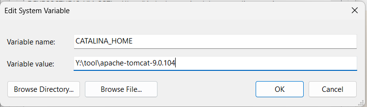
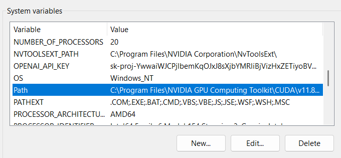
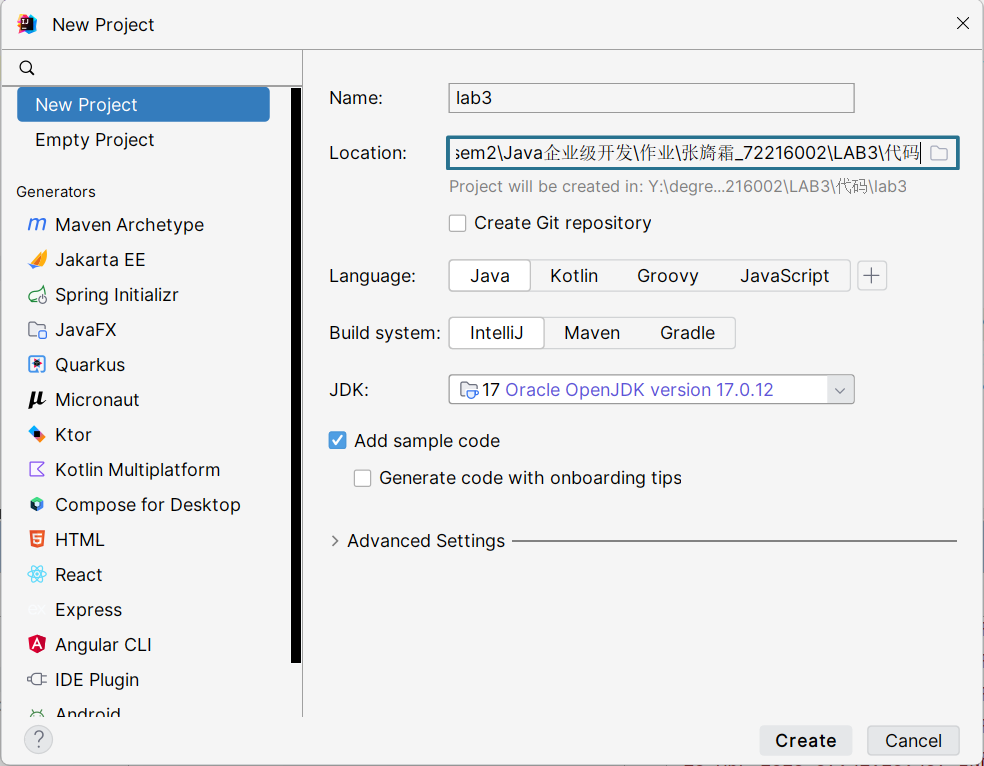
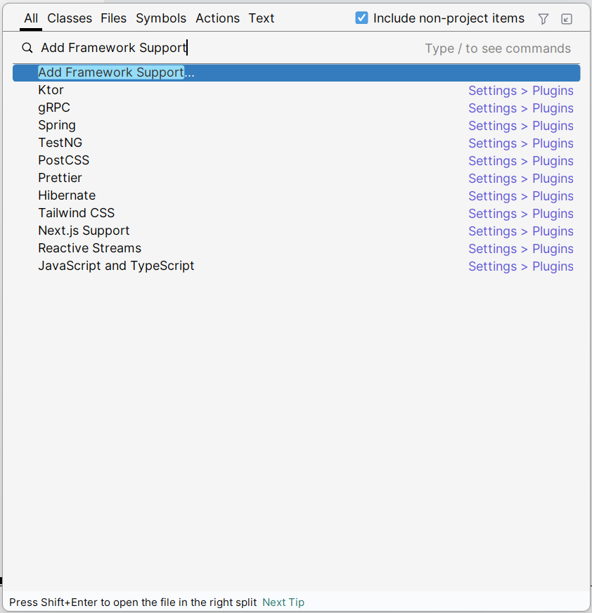
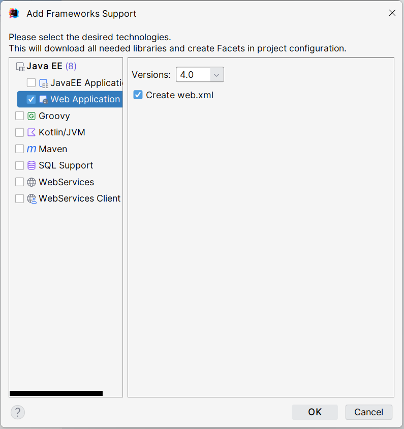
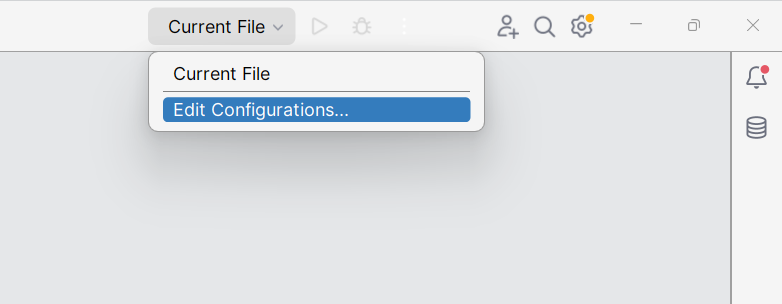
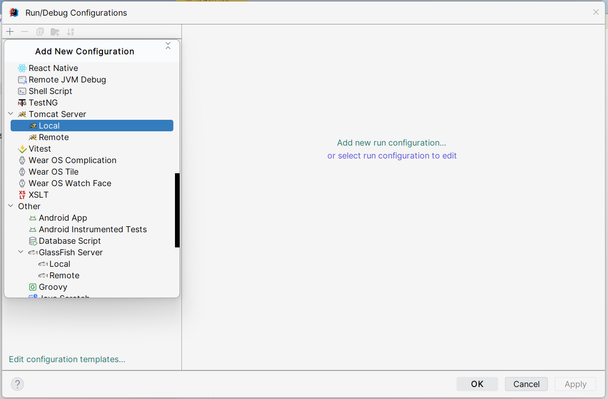
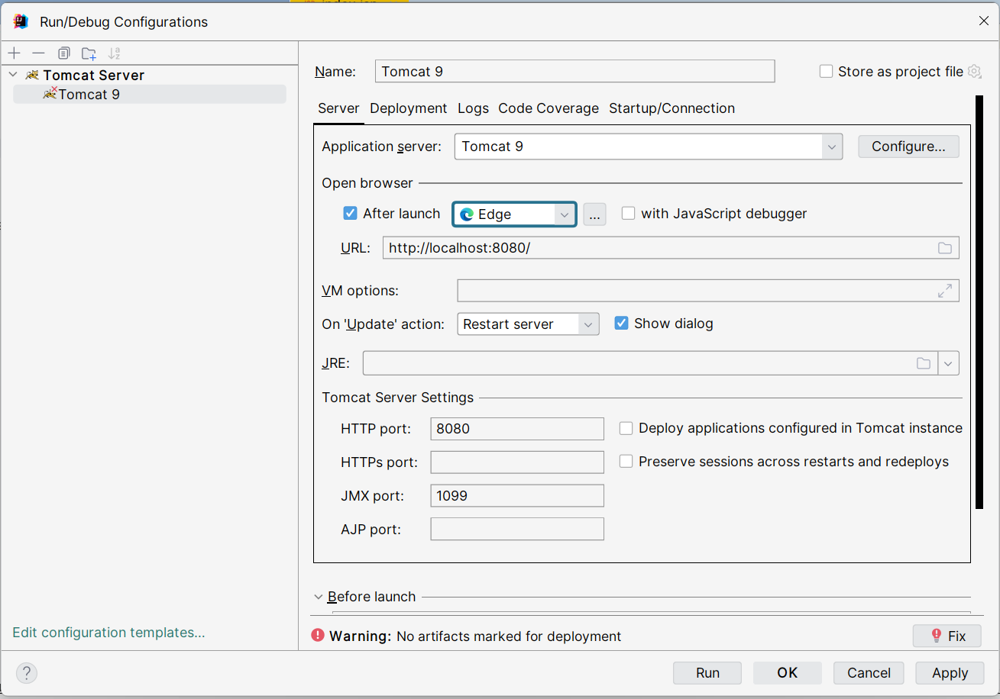
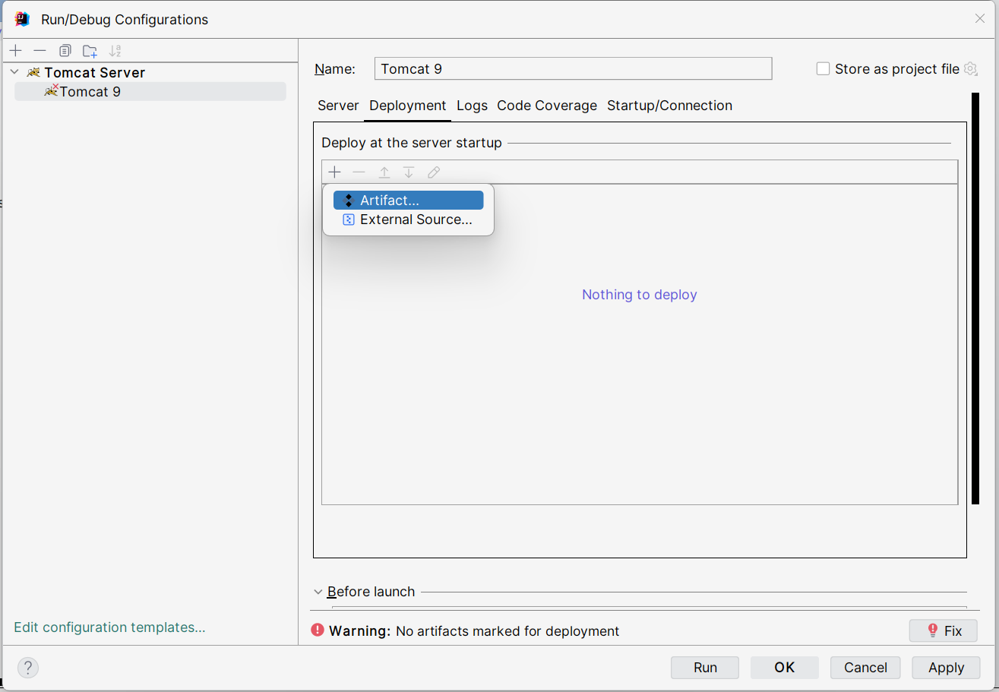
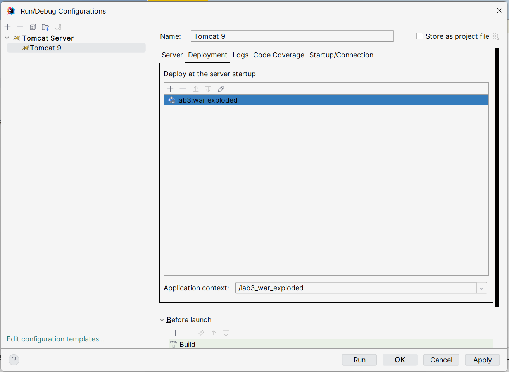

# Tomcat 配置流程

> IDEA 2023

## 下载 Tomcat

`https://tomcat.apache.org/download-90.cgi` - Core64-bit Windows zip

## 环境变量的配置

配置环境变量：`CATALINA_HOME`

然后找到 `Path` 双击，然后 `New` 添加 `%CATALINA_HOME%\bin`

## IDEA 中的配置

1. 创建新项目
   
   > Name：填写项目名称
   > Location：选择项目存放位置
   > JDK：选择项目的 JDK 版本
   > 点击 `Create` 创建项目

   

2. 打开 Add Framework Support 界面
   
   > 快捷键 `Shift` + `Shift` 打开搜索界面，勾上右上角的 `Include non-project items` ，搜索 `Add Framework Support`
   
   

3. 添加 Web 应用
   
   > 勾上 `Web Application`，然后勾上 `Create web.xml`，最后点击 `OK`
   
   

4. Edit Configuration
   
   > 点击右上角的 `Current File`，选择 `Edit Configuration`
   
   

5. 配置 Tomcat
   
   > 点击左上角的 `+` 号，找到 `Tomcat Server` 下的 `Local`
   
   

6. Server 板块的设置
   
   > 在 `Open browser` 下面有一个可以选择 `After launch` 默认打开的浏览器，选择自己要使用的浏览器
   
   

7. Deployment 板块的设置
   
   > 点击左上角的 `+` 号，选择 `Artifact...`
   
   

8. 设置默认路径
   
   > 在下方的 `Application context` 可以设置默认路径，每次要打开我们的网页的根路径就是这个。然后点击 `Apply` ， `OK`
   
   